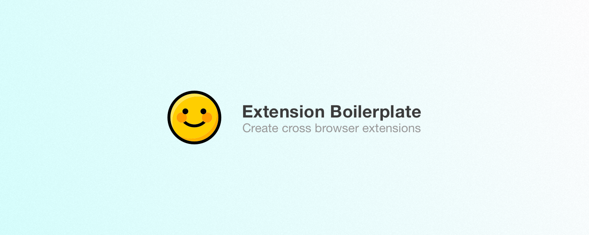

  <h1>
    Extension Boilerplate  
  </h1>

  

    <strong>A foundation for creating browser extensions for Chrome, Opera & Firefox.</strong>
  

Now that Firefox supports WebExtensions, it has become a lot easier to build browser extensions/addons for multiple browsers without duplicating the codebase. This project serves as a sensible starting point to help you get started.

I have extracted this from the browser extensions that I built for my side-project, [Email This](https://www.emailthis.me).

> Side note: Do check out [**Email This**](https://www.emailthis.me). It is a simpler alternative to bookmarking tools like Pocket, Readability & Instapaper. Email This will remove ads & distractions from an article and send you a nice email with just the text/images. You can then open up the email client on your laptop/mobile and read the article whenever you want. No need to install any additional applications or login to another app just to access your bookmarks.

## Features

<dl>
  <dt>Write once and deploy to Chrome, Opera & Firefox</dt>
  <dd>
    Based on WebExtensions. It also includes a tiny polyfill to bring uniformity to the APIs exposed by different browsers.
  </dd>
</dl>

<dl>
  <dt>Live-reload</dt>
  <dd>
    Your changes to CSS, HTML & JS files will be relayed instantly without having to manually reload the extension. This ends up saving a lot of time and improving the developer experience.
  </dd>
</dl>

<dl>
  <dt>Sensible starting point</dt>
  <dd>
    This comes with a gulp based workflow that converts modern <strong>ES6</strong> JavaScript and <strong>SCSS</strong> to JS/CSS. 
  </dd>
</dl>

<dl>
  <dt>Sketch (.sketch) assets for icons and promo images</dt>
  <dd>
    A .sketch file is included in the resources directory. This has all the icons and promo images that will be needed while uploading the extensions to the app stores.
  </dd>
</dl>

## Installation
1. Clone the repository `git clone https://github.com/EmailThis/extension-boilerplate.git`
2. Run `npm install`
3. Run `npm run build`

##### Load the extension in Chrome & Opera
1. Open Chrome/Opera browser and navigate to chrome://extensions
2. Select "Developer Mode" and then click "Load unpacked extension..."
3. From the file browser, choose to `extension-boilerplate/build/chrome` or (`extension-boilerplate/build/opera`)

##### Load the extension in Firefox
1. Open Firefox browser and navigate to about://debugging
2. Click "Load Temporary Add-on" and from the file browser, choose `extension-boilerplate/build/firefox`

## Developing
The following tasks can be used when you want to start developing the extension and want to enable live reload - 

- `npm rum chrome-watch`
- `npm run opera-watch`
- `npm run firefox-watch`

## Packaging
Run `npm run dist` to create a zipped, production-ready extension for each browser. You can then upload that to the appstore.

## TODO
- [ ] Add support for Safari
- [ ] Add Firefox & Opera Promo images
- [ ] Add sample screenshot templates
- [ ] Write a guide for using config variables & JS preprocessor

-----------
This project is licensed under the MIT license. 

If you have any questions or comments, please create a new issue. I'd be happy to hear your thoughts.

Bharani, [Email This](https://www.emailthis.me)
